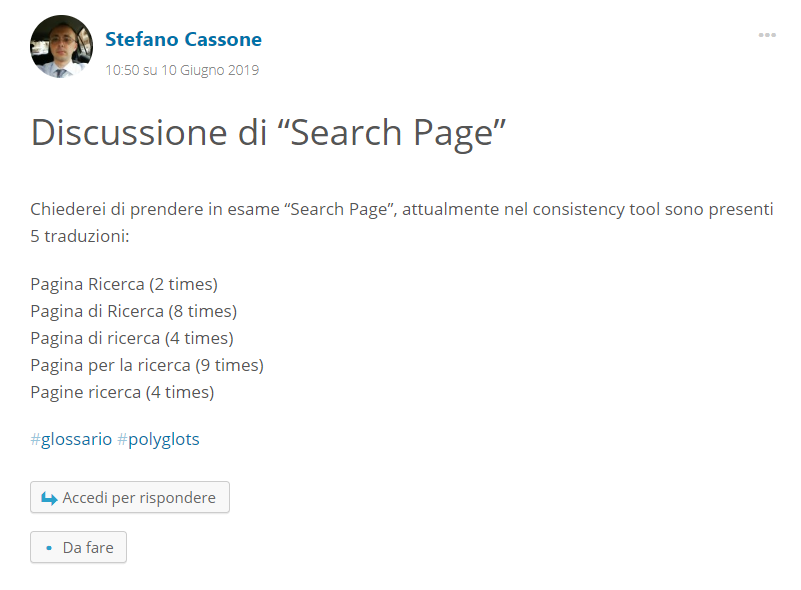

# [GUIDA] Il mentoring

Suggerimenti per come condurre il mentoring

* Cercare di capire chi si ha di fronte
* Cercare di instaurare una relazione amichevole e positiva
* Ricordarsi che il feedback che diamo è sempre circostanziato e legato al lavoro specifico (il messaggio implicito da passare è: se hai fatto un’incoerenza in questa stringa, non significa che sei un cattivo traduttore o uno stupido o una brutta persona) 
* Dare un feedback puntuale stringa per stringa (o almeno per tipologia di stringhe/incoerenze). 
* Spiegare, via via durante il discorso qual è il nostro sistema organizzativo: come usiamo i canali, come inseriamo i termini nel glossario, riunioni, ecc.
* In caso di problemi nelle traduzioni, non dire “hai sbagliato” oppure “ci sono degli errori” ma frasi tipo “sono presenti delle incongruenze”, “ci siamo quasi” o “rivedi la stringa, potrebbe non essere chiaro il senso della traduzione”
* Ricordare che la regola principale è sempre: se non sai o hai un dubbio: chiedi! E spiegare che quando si chiede aiuto nel canale live è sempre importante spiegare il contesto e inserire il permalink della stringa
* Spiegare, mentre si sviluppa il discorso e la relazione, come funziona GlotPress
* Ricordare che, quando si traduce e non si è PTE e si nota un proprio errore PRIMA di sottoporre una nuova traduzione è importante rifiutare la propria traduzione sbagliata.
* Come aiuto per le traduzioni, passare gli indirizzi del Glossario - https://translate.wordpress.org/locale/it/default/glossary - e del Consistency Tool - https://translate.wordpress.org/consistency
* In caso di traduzioni effettuate da stranieri, verificare con attenzione le stringhe perché spesso tradotte da Google Translate; nel caso di dubbi, meglio respingere le stringhe
* Ricordare di dire che: se si è già fatto il mentoring una volta, non si rifà più e, in caso di richiesta per nuovi progetti si approva automaticamente 

## Regole di traduzione da suggerire al traduttore
* Come prima traduzione suggerire di partire da un plugin o da un tema che si sta usando, in modo da controllare dove compaiono le stringhe e verificare così la correttezza delle traduzioni nel contesto
* Se il traduttore non ha già tradotto tutte le stringhe, accordarsi per dei momenti di verifica, ad esempio dopo 15 stringhe, per evitare il ripetersi dello stesso tipo di errore in più stringhe e diminuire lo stress del nuovo volontario
* Sconsigliare l’utilizzo di Google Translate, spesso viene sbagliata la traduzione o cambiato il senso della traduzione stessa
* Le stringhe che alla voce Comments riportano “Found in changelog list item.” non devono essere tradotte ma riportate uguali all’originale, salvo casi eccezionali.
* Prestare attenzione alle parti in html che possono causare problemi nella fase di traduzione, spesso i traduttori automatici immettono degli spazi: ad esempio, _`&nbsp;`_ va lasciato come _`&nbsp;`_
* Prestare MOLTA attenzione ai placeholder: es _%s, %d, %1$s_ e così via. **NON** vanno tradotti e, se tradotti male, creano problemi nella traduzione. Spesso sono aperture e chiusure di tag e non vanno lasciati spazi tra il placeholder e il testo.
* Quando si traduce, utilizzare gli articoli e le preposizioni in modo da non rendere impersonali le traduzioni: no a traduzioni tipo “Lasciare recensione” o “Rimuovere immagine anteprima”, sì a traduzioni tipo “Lascia una recensione” e “Rimuovi l'immagine di anteprima”
* Evitare l’abuso delle lettere maiuscole, nella traduzione non serve abbondare se sono presenti negli originali, basarsi sul senso della traduzione
* Fare attenzione a non tradurre il nome dei plugin/temi, né il nome degli autori

### TOOLS
Glossario - https://translate.wordpress.org/locale/it/default/glossary 

Consistency Tool - https://translate.wordpress.org/consistency

Dizionario delle alternative agli anglicismi in italiano - https://aaa.italofonia.info/ 

Glotdict - https://github.com/Mte90/GlotDict 

### PER INIZIARE
Per iniziare…. - https://it.wordpress.org/traduzioni/ 

Translator Handbook (inglese) - https://make.wordpress.org/polyglots/handbook/ 

Pagina dei progetti in italiano - https://translate.wordpress.org/locale/it/ 

## Riferimenti terminologici e stilistici
### Glossario
Lo scopo del glossario è dare indicazioni per termini particolari o per indicazioni che esulano dalla traduzione “normale” di un termine.

La lista dei termini è disponibile al link https://translate.wordpress.org/locale/it/default/glossary.

#### Come sottoporre termini da inserire nel glossario
Per prima cosa, controlla che il termine che vuoi sottoporre non sia già presente nel glossario in GlotPress.

Se il termine non è presente, raggiungici su [it.wordpress.org/team](https://it.wordpress.org/team/) e crea un nuovo post, indicando il termine che vuoi discutere, il tuo suggerimento e tutte le informazioni a riguardo che aiutino a capirne contesto e motivazione. Prima di pubblicare, ricordati di inserire il tag *glossario* alla fine.

<small>Immagine di esempio di un termine suggerito su Team</small>

*Nota: il tuo primo post non sarà visibile immediatamente, ma andrà in moderazione*

Una seconda modalità per proporre la discussione di un termine (ma anche per contribuire alle decisioni) è partecipare alla riunione settimanale dei polyglots. La riunione si tiene di giovedì alle 13 e alle 19, a settimane alterne, nel canale #polyglots sullo Slack italiano.

### Accademia della Crusca
http://www.accademiadellacrusca.it/it/copertina
### Treccani
Portale: http://www.treccani.it/magazine/lingua_italiana/

Vocabolario: http://www.treccani.it/vocabolario/

Sinonimi: http://www.treccani.it/sinonimi/

### WordReference
http://www.wordreference.com/enit/welcome

## GlotPress
https://translate.wordpress.com/glotpress/

https://make.wordpress.org/polyglots/handbook/tools/glotpress-translate-wordpress-org/

Di recente GlotPress integra la funzione di suggerimento delle parole. Quindi, quando entri in una stringa per tradurre, le parole presenti nel glossario sono sottolineate e il suggerimento di traduzione viene visualizzato al passaggio del mouse.

## GlotDict

GlotDict è un’estensione per Chrome e Firefox che ti permette di visualizzare suggerimenti per i termini del glossario ufficiale all’interno della pagina in cui stai traducendo. Per maggiori informazioni, guarda il [video](https://wordpress.tv/2016/05/31/daniele-scasciafratte-glotdict-how-a-browser-extension-changes-your-translation-workflow/) e visita la pagina di GlotDict su [GitHub](https://github.com/Mte90/GlotDict).

Scarica GlotDict per il tuo browser:
* Firefox: [Instructions](https://support.mozilla.org/en-US/kb/find-and-install-add-ons-add-features-to-firefox) - [Download](https://addons.mozilla.org/it/firefox/addon/glotdict/)
* Chrome: [Instructions](https://support.google.com/chrome_webstore/answer/2664769?hl=en) - [Download](https://chrome.google.com/webstore/detail/glotdict/jfdkihdmokdigeobcmnjmgigcgckljgl)

## Consistency Tool
Questo strumento consente di verificare la coerenza nell’utilizzo di un termine nelle traduzioni.

https://translate.wordpress.org/consistency

## Spreadsheet trovato sul sito
https://docs.google.com/spreadsheets/d/1P3VL0zhXB_KExnhYjVrk73TtQdyotdpiwZ8FbvGQpIg/pubhtml?gid=0&single=true

### Post di risorse 
da verificare se c’è qualche risorsa ulteriore qui: https://it.wordpress.org/team/2017/12/21/risorse-per-localizzare-wordpress-in-italiano/

